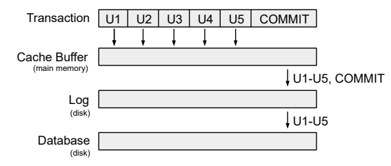
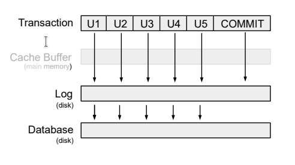
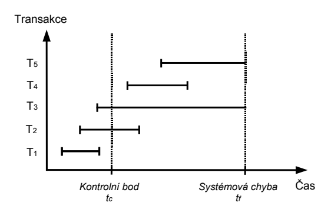
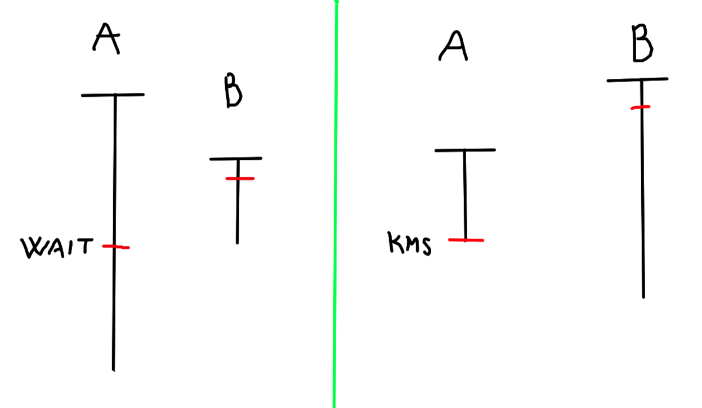
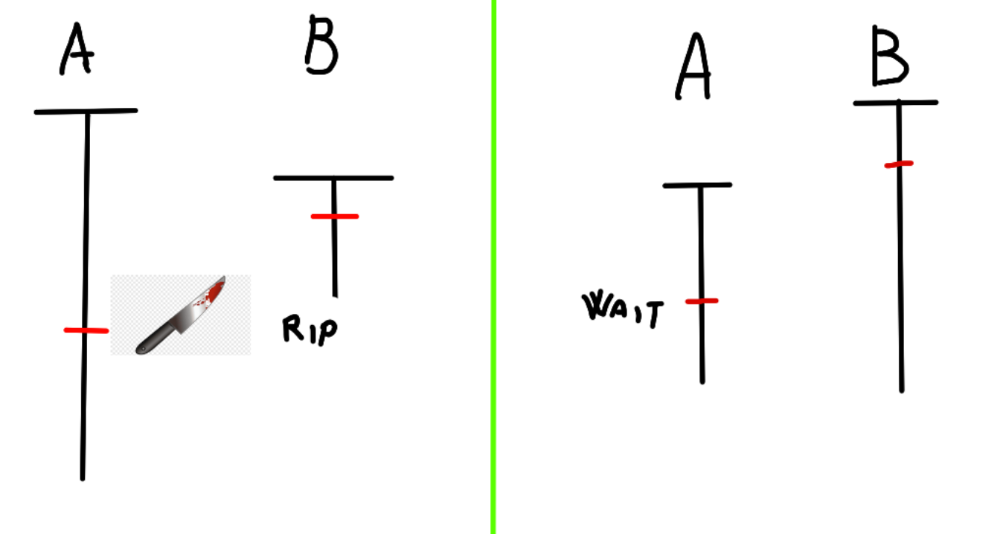

<style>
h3
{
    font-weight: bold;
}
table {
    margin-bottom: 24px;
    border-spacing: 0;
    border-bottom: 2px solid black;
    border-top: 2px solid black;
}
table th {
    padding: 3px 10px;
    background-color: white;
    border-top: none;
    border-left: none;
    border-right: none;
    border-bottom: 1px solid black;
}
table td {
    padding: 3px 10px;
    border-top: 1px solid black;
    border-left: none;
    border-bottom: none;
    border-right: none;
}
</style>


# PL/SQL  (2)
### Výhody 
- kombinace procedurální logiky a SQL
- méně přenášených dat
- sdílení kódu mezi aplikacemi, nezávislost na platformě

### Nevýhody 
- horší přenositelnost mezi jinými DBS (ale jak často to potřebujeme?)

## PL/SQL blok
```sql
declare -- nepovinná deklarace lokálncích proměnných
begin -- povinné otevření bloku příkazů
exception -- nepovinné zachytávání vyjímek
end -- povinné ukončení bloku
|| -- operátor konkatenace (sjednocení řetězců)
v_lg Student.login%TYPE -- proměnná v_lg bude stejného typu co Student login 
%ROWTYPE -- strukturovaný datový typ
```

## Vyjímky
- s `set autocommit on` bude každý příkaz jedna transakce, takže operace `commit` a `rollback` nemají smysl
- s `set autocommit off` začíná transakce koncem té předchozí a je ukončena `commit` nebo `rollback`

#### Příklady vyjímek
- `NO_DATA_FOUND` - `select` nevrátil žádný řádek
- `TOO_MANY_ROWS` - `select into` vrátilo více než jeden řádek
- `VALUE_ERROR` - chybná manipulace s hodnotou

<hr>

# Procedury (3)
Několik typů procedur:
- Anonymní procedury
    - víceméně `begin ... end;` blok 
- Pojmenované procedury
- Pojmenované funkce
    - vrací hodnotu, narozdíl od procedur

## Trigger
- spouští se v závislosti na nějakém příkazu (např. `insert`, `update`, `delete`)
    - `before` - před provedením příkazu
    - `after` - po provedení příkazu
    - `instead of` - místo provedení příkazu

<hr>

# Cykly (4)
- `loop` - nekonečný cyklus
- `while` - cyklus s podmínkou na začátku
- `for` - cyklus s podmínkou na začátku a s inkrementací na konci

## Kurzory
- Implicitní kurzor
    - vytváří se automaticky po provedení příkazů jako `insert`, `update`, `delete`
- Explicitní kurzor
    - `open jmeno_kurzoru` - otevření kurzoru
    - `fetch jmeno_kurzoru` - načítá aktuální záznam kurzoru do proměnné a posune se na další záznam
    - `close jmeno_kurzoru` - uzavření kurzoru

## Balíky
- Něco jako knihovny v jiných jazycích
- Seskupují procedury, funkce, proměnné, vyjímky do jednoho jmeného prostoru
- Specifikace a tělo

## Bulk operace
- `bulk collect` - načtení více záznamů do kolekce
- `forall` - provedení operace nad všemi záznamy v kolekci

<hr>

# Statické a dynamické SQL (5)
- V PL/SQL bloku můžeme přímo volat pouze statické příkazy
    - `select, insert, update, delete, merge`
    - `lock table, commit, rollback, savepoint, set transaction`

## Dynamické SQL
- umožňuje sestavit a volat jakékoliv SQL příkazy (na které má uživatel právo) za běhu aplikace
- Nevýhoda je, že nelze ověřit syntaktickou správnost
- Nebezpečí sql injection
- **Používame jen tehdy, když není možno použít statické PL/SQL**

## Zpracovaní dotazu
- DBS kontroluje, zda už nebyl příkaz dříve zaslán
- Pokud byl zaslán poprvé:
    1) Je naparsován a vytvoří se plán vykonávání dotazu
    2) Dotaz může být vykonán mnoha způsoby, DBS hledá ten nejlepší
    3) Tento proces může trvat déle, než samotné vykonání dotazu
- Pokud by již dříve zaslán, použije se dříve vytvořený plán vykonávání
- Při kontrole zda už nebyl vykonán se kontroluje cel řetězec
    - `select * from student where login = 'x'` a `select * from student where login = 'y'` se budou lišit
- Používání **vázaných proměnných** (bind variables) umožňuje využít již vytvořený plán vykonávání
    - `select * from student where login = :lg` a `select * from student where login = :lg` se budou shodovat
    - Snižuje se tím zátěž na DBS a čas vykonávní
- PL/SQL používá vázané proměnné automaticky
- *Vázané proměnné můžeme použít pouze u literálů (např. hodnoty atributu.. né jména tabulky)*
- Porovnání výkonu
    - bez vázaných proměnných: 65.48s
    - s vázanými proměnnými: 0.25s

## SQL injection
### Ochrana
- Používaní statických dotazů
- V dynamických dotazech používat vázané proměnné
- Správné řízení přístupu (přístupová práva)
- Nepoužívat hodnotu přímo (třeba prvně převést na číslo)

### Má smysl psát logiku aplikace v PL/SQL?
- rozhodně **ANO**

<hr>

# Transakce (6)
## Zotavení databáze
### Zotavení (recovery) => zotavení databáze z nějaké chyby (přetečení hodnoty atributu, pád systému)
- Základní jednotkou zotavení je transakce
- Né všechny DBS zotavení podporují
- Výsledkem zotavení musí být korektní stav
- Pro zotavení se používá **redundatní informace** 
- Komponenta SŘBD, která se stará o řízení transakcí je `manager transakcí`

## Korektní vs Konzistentní stav?
- Korektní stav - stav, který odpovídá omezením (např. hodnota atributu musí být v intervalu) ????
- TBD.. pm me

## Transakce
- Logická jednotka práce s db (taky jednotkou zotavení)
- Transakce nemůže být uvnitř jiné transakce => Atomická, nědělitelná
- Začíná operací `begin transaction` a končí `commit` nebo `rollback`
- Programátor je řídí pomocí příkazů `commit`(potvrzení) a `rollback`(vrácení)

## Klasifikace chyb
- Lokální chyby
    - Chyba v dotazu, přetečení dotazu
- Globální chyby
    - Systémové (soft crash) - Vpadek proudu, nebo pád systému
    - Chyba HW (hard crash) - Poškození disku, nebo ztráta dat

## Potvrzovací bod
- Operace `commit` zavádí potvrzovací bod
- Operace `rollback` vrací databázi do stavu posledního potvrzovacího bodu
- V okamžiku potvrzení:
    - Všechny změny jsou trvale uloženy v databázi
    - Všechny adresace a zámky entic uvolněny

## Vlastnost ACID
- **A** => Atomičnost - transakce je nedělitelná => musí být provedeny všechny operace, nebo žádná
- **C** => Korektnost- transakce převádí korektní stav db do jiného korektního stavu (mezi začátkem a koncem nemusí být db v korektním stavu)
- **I** => Izolovanost - transakce jsou navzájem izolovány => změny provedené jednou transakcí jsou pro ostatní viditelné až po `COMMIT`
- **D** => Trvalost - změny provedené transakcí jsou trvale uloženy v db 
- *(atomicity, consistency, isolation, durability)*

## Implementační detaily
- Všechny změny musí být zapsány do logu před samotným zápisem změn do db
    - Po `commit` je zapsán do logu commit záznam
- Říká se tomu **pravidlo dopředného zápisu** (**write-ahead log rule**)

## Zotavení systému
- Zotavení není vázáno pouze na jednu transakci, ale na celou databázi
- Hlavní problémem při systémové chybě, je ztráta obsahu vlastní paměti
- Během zotavení se po restartu provádí:
    - Přesný stav transakce přerušné chybou není znám
        - Musí být zrušena (UNDO)
    - Transakce byla úspěšně ukončena, ale změny nebyly přeneseny z logu do db
        - Musí být přepracována (REDO)

## Základní techniky zotavení
- Odložená (NO-UNDO/REDO) *deferred update*
    - Neprovádí aktualizaci logu a db až do potvrzení transakce
    - Všechny aktualizace jsou zapsány do paměti
    - Po `commitu` jsou aktualizace nejprve zaznamenány do logu a pak do db
    - Pokud transakce selže, není **nutné provést UNDO** (protože db nebyla aktualizována)
    - **REDO** bude provedeno, jestli DBS zapsal aktualizace do logu, ale né do db
    - Používa se pouze u krátkých transakcí, jinak **hrozí přetečení**(používá se In-Memory DBS)



- Okamžitá (UNDO/NO-REDO) *immediate update*
    - Provádí aktualizaci logu po každé aktualizaci transakce
    - Aktualizace jsou zapsány do logu, poté do db
    - Pokud transakce selže, je nutné provést **UNDO** (na disk byly zapsány aktualizace, které musí být zrušeny)
    - Do logu se *ukládají původní hodnoty*, což umožňuje UNDO
    - **REDO** není nutné, protože aktualizace byly zapsány do db
    - (UNDO/NO-REDO), protože aktualizace bbyly zapsány do db před potvrzením transakce 
    - **Nízký výkon**



- Kombinovaná (UNDO/REDO)
    - Aktualizace jsou zapisovány do logu po commitu
    - K aktualizaci dochází v určitých časových intervalech - **Kontrolní body (checkpoint)**
    - Kontrolní body jsou vytvářeny třeba po určitém počtu záznamů
        - Zápis dosud provedených aktualizací do db
        - Zápis záznamu o kontrolním bodu do logu
    - Aktualizace db se týká všech transakcí vykonávaných v době kontrolního bodu, a transakcích před



- T1 => úspěšně dokončena před Tc, aktualizace byly do logu zapsány při COMMITu => zapsána do db
- T2 => DBMS provede **redo** pro aktualizace provedené po Tc
- T3 => DBMS provede **undo** pro aktualizace provedené před Tc
- T4 => DBMS provede **redo** pro všechny aktualizace (ty byly při COMMITu zapsány do logu)
- T5 => Neřešímě.. COMMIT nebyl proveden a žádné aktualizace nebyly zapsány do db v čase Tc

### Po restartu DBS spustí tento algoritmus:
1) Vytvoř 2 seznamy transakcí: UNDO a REDO
2) Do UNDO vlož všechny transakce, které nebyly potvrzeny před posledním kontrolním bodem (REDO je prázdné)
3) Začni procházet záznamy v logu od posledního kontrolního bodu
    1) Pokud je pro transakci T nalezen v logu záznam COMMIT, přesuň T z UNDO do REDO
4) DBS prochází log zpětně a ruší aktualizace transakcí ze seznamu UNDO
5) DBS prochází log dopředu a přepracovává aktualizace transakcí ze seznamu REDO
6) Databáze je v korektním stavu *eyyy \o/* 

## Záchrané body (savepoints)
- Koncept záchraných bodů byl zaveden v SQL99, ale transakci **rozděluje na menší části**
- Při `ROLLBACK` dochází k návratu na záchraný bod
- Záchraný bod není ekvivalentní s potvrzením změn pomocí `COMMIT`

## Transakce (idk)
- Všechny SQL příkazy jsou atomické, až na (`CALL` a `RETURN`)
- S `AUTOCOMMIT ON` rollback nedává smysl

## Zotavení vs. Souběh
- V NO-SQL DBMS nejsou podporovány transakce pro řešení paralelního přístupu
- Programátor má zaručeno, že potvrzené aktualizace se z db neztratí
- V DBS většinou nejde izolovanost transakcí vypnout

# 7 skipped

<hr>

# Řízení souběhu (8)
- Možná klasifikace DBS:
    - Jednouživatelská - může jí používat jenom jeden uživatel v daném čase
    - Víceuživatelská - může jí používat více uživatelů současně

## Problémy souběhu
### Ztráta aktualizace (lost update)

| Čas | Transakce A | Transakce B |
| --- | ----------- | ----------- |
| t1  | READ t      |             |
| t2  |             | READ t      |
| t3  | WRITE t     |             |
| t4  |             | WRITE t     |

- Dojde ke ztrátě aktualizace provedené transakcí A, v čase t3

### Nepotvrzená závislost (uncommitted dependency)
- Problém nastává, když transakce A načte nebo aktualizuje záznam, který byl aktualizován doposud nepotvrzenou transakcí B
- Jelikož transakce nebyla potvrzená, může se stát, že se stane `ROLLBACK`
    - V tomto případě transakce A pracuje s hodnotami, které nejsou platné

| Čas | Transakce A | Transakce B |
| --- | ----------- | ----------- |
| t1  |             | WRITE t     |
| t2  | READ t      |             |
| t3  |             | ROLLBACK    |

- Transakce A pracuje s daty z t2, ačkoli platné hodnoty jsou hodnoty z t1

### Nekonzistentní analýza (inconsistent analysis)

| Čas | Data | Transakce A | Transakce B |
| --- | ---- | ----------- | ----------- |
| t1  | acc1=30<br/> acc2=20<br/> acc3=50 | READ acc1  <br/> suma=30  |             |
| t2  | acc1=30<br/> acc2=20<br/> acc3=50 | READ acc2  <br/> suma=50  |             |
| t3  | acc1=30<br/> acc2=20<br/> **acc3=60** | | WRITE acc3=60 |
| t4  | **acc1=20**<br/> acc2=20<br/> acc3=60 | | WRITE acc1=20 |
| t5  | acc1=20<br/> acc2=20<br/> acc3=60 | | COMMIT |
| t6  | acc1=20<br/> acc2=20<br/> acc3=60 | READ acc3  <br/> suma=110 ne 100  |             |

- Transakce A počítá součet zůstatků na účtech, Transakce B převádí částku 10 z účtu acc1 na acc3
- Transakce A má k dispozici nekonzistentní db,, proto vykoná nekonzistentní analýzu (místo součtu 100 dostane 110)
- Není to problém nepotvrzené závislosti, protože transakce B potvrdí všechny aktualizace předtím, než si A vyžádá acc3

## Konflikty čtení a zápisu

 *(R-Read, W-Write)*

- RR
    - Je v pohodě, nenastává žádný problém
- RW
    - Může nastat problém nekonziostentní analýzy => **problém nekonziostentní analýzy je zapříčiněn RW konfliktem**:

    | Čas | Transakce A | Transakce B |
    | --- | ----------- | ----------- |
    | t1  | READ t      |             |
    | t2  |             | WRITE t     |
    | t3  | (...)       |             |

    - Pokud B udělá aktualizaci a A načte znovu t, pak A získá odlišné hodnoty
    - Tomuto jevu říkáme **Neopakovatelné čtení** (non-repeatable read):

    | Čas | Transakce A | Transakce B |
    | --- | ----------- | ----------- |
    | t1  | READ t      |             |
    | t2  |             | WRITE t     |
    | t3  | READ t      |             |

- WR
    - A zapíše `t` a B pak chce číst `t`
    - Pokud B něco přečte, může nastat problém **nepotvrzené závislosti**
    - Tomuto jevu říkáme **Špinavé čtení** (dirty read):

    | Čas | Transakce A | Transakce B |
    | --- | ----------- | ----------- |
    | t1  | WRITE t     |             |
    | t2  |             | READ t      |
    | t3  | ROLLBACK??  |             |
    
- WW
    - A zapíše `t` a B pak chce zapisovat `t`
    - Pokud B něco zapíše, může nastat jak problém **ztráty aktualizace** tak problém **nepotvrzené závislosti**
    - Tomuto jevu říkáme **Špinavý zápis** (dirty write):

    | Čas | Transakce A | Transakce B |
    | --- | ----------- | ----------- |
    | t1  | WRITE t     |             |
    | t2  |             | WRITE t     |
    | t3  | ROLLBACK??  |             |

## Techniky řízení souběhu
- **Zamykání** (locking) - používá většina DBMS
    - Pesimistický přístup k souběžnému zpracování (Předpoklad, že se paralelní transakce budou navzájem ovlivňovat)
    - Systém má jednu kopii data jednotlivým transakcím přidělujej zámky
        - *(Funguje to prostě jak mutex/locking v pythonu, c# .. 8 - slide 22)*
- **Správa verzí** (multiversion) - používá většina DBMS
    - Optimistický přístup k souběžnému zpracování (Předpoklad, že se paralelní transakce nebudou navzájem ovlivňovat)
    - Vytváří kopie dat, a systém sleduje, která z verzí má být viditelná pro ostatní transakce
- Časová razítka (timestamps)
- Validace


## Typy zámků
- **Výlučný zámek** (exclusive lock, write lock) - označujeme X
    - Když A drží výlučný zámek na záznam `t`, pak požadavek paralelní transakce B na zámek libovolého typu na `t` není proveden
- **Sdíledný zámek** (shared lock, read lock) - označujeme S
    - Požadavek paralelní transakce B na zámek **X** na záznam `t` **není proveden**
    - Požadavek paralelní transakce B na zámek **S** na záznam `t` **je proveden** + B bude držet S na `t`
- Zámky jsou (*většinou*) přidělovány **implicitně**

## Zamykací protokol (data access protocol, locking protocol)
1) Transakce, která chce **získat záznam** z db musí nejprve požadovat **Sdílený zámek** (S)
2) Transakce, která chce **aktualizovat záznam** v db musí nejprve požadovat **Výlučný zámek** (X), pokud tato transakce drží S, jej změněn na X
3) Jestliže zámek požadovaný transakcí B nemůže být přidělen, B přejde do **stavu čekání** (wait state)
    - Transakce B v tomtu stavu setrvá minimmálně do doby, než transakce A uvolní zámek
    - Systém se musí postarat o to, aby transakce B nesetrvala v tomto stavu navždy (*livelock* nebo *starvation*)
4) **Výlučné** zámky jsou **automaticky uvolněny na konci transakce**, **Sdílené** zámky jsou také nejčastěji uvolněny na konci transakce

- Tomuto se říká **Přísné dvoufázové zamykání** (strict two-phase lockning)
    1) Zamykání zámků
    2) Uvolňování zámků

## Řešení problémů ztráty aktualizace

| Čas | Transakce A | Transakce B |
| --- | ----------- | ----------- |
| t1  | READ t<br/>Získán zámek S na `t`   |             |
| t2  |             | READ t<br/>Získán zámek S na `t`      |
| t3  | WRITE t<br/>Požadavek na zámek X na `t`      |             |
| t4  | wait        | WRITE t<br/>Požadavek na zámek X na `t`      |
| t5  | wait        | wait        |
| t6  | wait        | wait        |

- Aktualizace transakce A v t3 není akceptována, kvůli implicitnímu požadavku na zámek X, který koliduje s S přidělený B
- Transakce A přejde do stavu čekání. Ze stejného důvodu i B a obě transakce nepokračují v činnosti
 - Vyřešili jsme problém ztráty aktualizace, ale vznikl problém **uváznutí** (deadlock)

## Řešení problémů nepotvrzené závislosti

| Čas | Transakce A | Transakce B |
| --- | ----------- | ----------- |
| t1  |             | WRITE t<br/>Získán zámek X na `t`      |
| t2  | READ t<br/>Požadavek na zámek S na `t`   |             |
| t3  | wait        | COMMIT/ROLLBACK<br/>Uvolnění zámku X na `t`      |
| t4  | opakuj: READ t<br/>Získán zámek S na `t`      |             |


| Čas | Transakce A | Transakce B |
| --- | ----------- | ----------- |
| t1  |             | WRITE t<br/>Získán zámek X na `t`      |
| t2  | WRITE t<br/>Požadavek na zámek X na `t`   |             |
| t3  | wait        | COMMIT/ROLLBACK<br/>Uvolnění zámku X na `t`      |
| t4  | opakuj: WRITE t<br/>Získán zámek X na `t`      |             |

- Jelikož transakce A není závislá na nepotvrzené aktualizaci transakce B, tento problém souběhu je vyřešen

## Řešení problému nekonzistentní analýzy
- To jsem moc lazy psát..
- Vyřešíme problém nekonzistentní analýzy, ale vznikne problém uváznutí (deadlock)

## Řešení problému uváznutí
1) Detekce uváznutí:
    1) Nastavení časových limitů
    2) Detekce cyklů v grafu *Wait-for*
2) Prevence uváznutí pomocí časových razítek

## Řešení uváznutí
- Snažíme se uváznutí předejít úpravou uzamykacího protokolu

1) Každé transakci je předěleno časové razítko - čas začátek transakce - **je unikátní**
2) Pokud transakce A požaduje zámek na záznam, který už je uzamčený transakcí B
    - **Wait-Die**: pokud je A starší než B, pak A čeká. Pokud je A mladší, A je zrušená pomocí `ROLLBACK` a spuštěna znovu
    
    
    
    - **Wound-Wait**: pokud je A starší než B, pak B je zrušená pomocí `ROLLBACK` a spuštěna znovu. Pokud je A mladší, A čeká

    

3) Pokud je transakce spuštěna znovu, necháva si původní timestamp

(wait-die: A čeká, wound-wait: B je zabito.. vždycky je zabito mladší)

<hr>

# Sériový a serializovatelný plán (10)
- Pokud jsou transakce provedeny za sebou, mluvíme o **sériovém plánu**
- Seriový plán zapisujeme jako entici uspořádanou podle pořadí vykonávání .. *(A,B)* ..
- Serializovatelnost => Míra korektnosti
<br/>
1) Ekvivalentní plány
    - Dva plány pro stejné transakce jsou ekvivalentní, když dávaí stejné výsledky
2) Serializovatelný plán   
    - Plán je serializovatelný, pokud je ekvivalentní s nějakým sériovým plánem
- Dvoufázové zamykání zajišťuje serializovatelnost plánu

## Věta o dvoufázovém uzamykání?
- Pokud transakce dodržují přísné dvoufázové uzamykání, pak všechny možné souběžné plány jsou serializovatelné

## Transfer Processing Performace
- Měří se propustnost (počet transakcí za vteřinu)

## Úroveň izolace
- Serializovatelnost garantuje izolaci transakcí ve smyslu podmínky `ACID`
- Za izolovatelnost transakcí musíme zaplatit .. (*nižším výkonem*)
- SŘBD proto umožňují nastavit úroveň izolace transakcí

- 4 úrovně izolace:
    - READ UNCOMMITTED (RU) - Můžu uvolnit S a X předkoncem
    - READ COMMITTED (RC) - Můžu uvolnit S před koncem
    - REPEATABLE READ (RR)
    - SERIALIZABLE (S)

| Úroveň izolace | Špinavé čtení | Neopakovatelné čtení | Výskyt fantomů |
| -------------- | ------------ | -------------------- | -------------- |
| READ UNCOMMITTED | ano | ano | ano |
| READ COMMITTED | ne | ano | ano |
| REPEATABLE READ | ne | ne | ano |
| SERIALIZABLE | ne | ne | ne |

## Neopakovatelné čtení
- vyskytuje se od READ COMMITED a níž
- `SELECT` požaduje zámek S, ale nedodrží dvoufázové zamykání.. může zámek uvolnit před ukončením transakce
- X zámky jsou uvolněny až po ukončení transakce

| Čas | Transakce A | Transakce B |
| --- | ----------- | ----------- |
| t1  | SELECT t    |             |
| t2  |             | UPDATE t    |
| t3  |             | COMMIT      |
| t4  | SELECT t    |             |
| t5  | COMMIT      |             |

- Kde se `SELECT` a `UPDATE` týkají stejného záznamu `t`

## Výskyt fantomů
- Vyskytuje se od REPEATABLE READ a níž

| Čas | Transakce A | Transakce B |
| --- | ----------- | ----------- |
| t1  | SELECT \<t0-t2>    |             |
| t2  |             | INSERT t    |
| t3  |             | COMMIT      |
| t4  | SELECT \<t0-t2>    |             |
| t5  | COMMIT      |             |

- Kde se `SELECT` a `INSERT` týkají stejné množiny záznamů

## Správa verzí
- Nevýhodou je zvýšený požadavek na paměť
- Pokud převažují čtení, je výhodnější použít správu verzí
- SŘBD proto často používají kombinaci obou

## Granualita zámků
- Zámky mohou být udělovány na různých úrovních
    - Databáze, Tabulka, Záznam, Hodnota atributu
- Důvodem zavedení je zvýšená propustnost
- U malých objektů => jemná granualita
- U velkých objektů => hrubá granualita

<hr>

# Fyzická implementace (11)
- Záznamy v tabulce nejsou nijak uspořádány
- Záznamy nejsou fyzicky mazány, ale jen označeny jako smazané
    - Teoreticky O(1), ale záznam se musí najít, takže O(n)
    - Počet blok haldy se po operaci nesnižuje
- Vkládání je teoreticky O(1), ale musí se kontrolovat primární klíče.. takže O(n)

## Cena operací plánu
- IO Cost - počet přístupů ke stránkám
- CPU Cost - počet operací s daty
- Čas operace (Processing time) - záleží na konkrétním serveru, méně často používaný

## Index
- Datová struktura **B plus -strom**, poskytuje O(log n) složitost základních operací
    - data jsou jen v listech a mají navzájem na sebe pointery jako normální pole 
    - [vskutku interesující struktura](https://www.geeksforgeeks.org/introduction-of-b-tree/)

- Automaticky vytvořen pro primární klíč u oracle databáze
- Index je dvojce (hodnota pk, odkaz na záznamm do haldy)
- Tomu odkazu se říka RID nebo ROWID
- Urychluje vysoce selektivní dotazy? (malý počet záznamů)

## Rozshavhový dotaz v indexu
- najdu první výskyt
- sekvenčně projedu rozsah
- vrátím rozsah


## Složený klíč
- Pokud klíč obsahuje více atributů, říkáme mu složený klíč
- Lexikografické uspořádání

| ID zakázky | ID produktu | Cena |
| --- | ----------- | ----------- |
| 1   | 123         | 32          |
| 1   | 124         | 5454        |
| 1   | 321         | 217         |
| 2   | 123         | 3017        |
| 2   | 321         | 247         |

- vyhledávání pomocí indexu se neprovede pokud budeme hledat ``WHERE ID_produktu = 123``
    - místo toho se raději bude hledat na heapu
